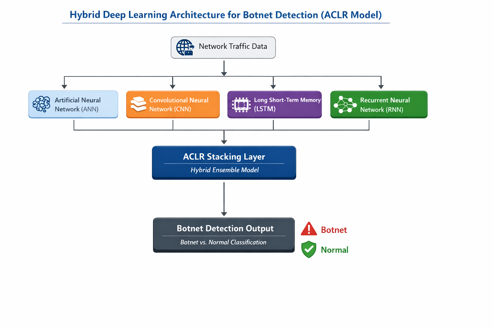
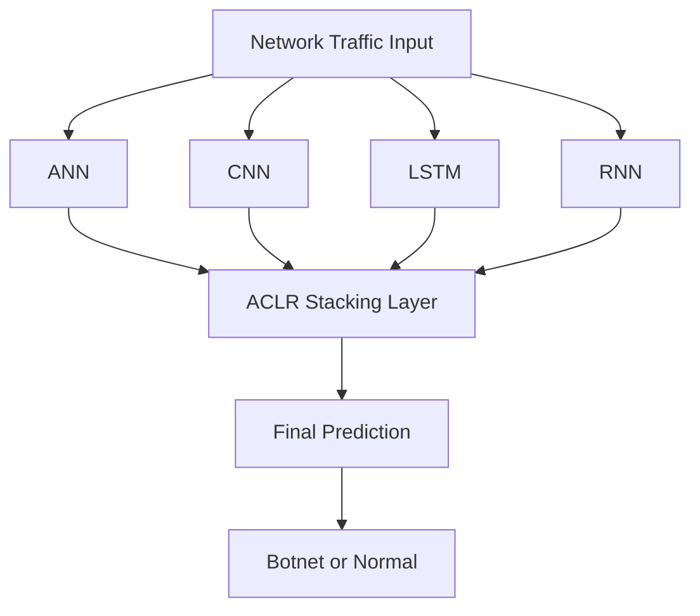

# 🤖 Hybrid Deep Learning Model for Botnet Detection in IoT


---

## 📌 Overview

This project presents a **hybrid deep learning model (ACLR)** for detecting botnet attacks in IoT environments. By combining multiple neural networks, the system improves detection accuracy and adapts to evolving cyber threats.

---

## ⚠️ Problem Statement

Traditional intrusion detection systems fail to detect **unknown and evolving botnet attacks** in IoT networks due to limited pattern recognition and high false positives.

---

## 💡 Proposed Solution

A **stacked hybrid model (ACLR)** combining:

* 🧠 ANN → Complex feature learning
* 🧩 CNN → Spatial pattern extraction
* ⏳ LSTM → Temporal dependency learning
* 🔁 RNN → Sequential behavior modeling

---

## 🏗️ Architecture

### 📷 Diagram



### 🔄 Flow Representation



---

## 📊 Dataset

* UNSW-NB15 dataset
* Includes multiple attack types:

  * Normal
  * DoS
  * Exploits
  * Fuzzers
  * Reconnaissance
  * Backdoor
  * Shellcode
  * Worms

---

## ⚙️ Methodology

1. Data preprocessing & normalization
2. Train ANN, CNN, LSTM, RNN models
3. Combine models using stacking (ACLR)
4. Evaluate using:

   * Accuracy
   * Precision
   * Recall
   * ROC-AUC

---

## 📈 Results

* ✅ Accuracy: ~96–99%
* ✅ Strong multi-class classification
* ✅ Improved detection of unknown attacks
* ✅ Reduced false positives

---

## 🚀 How to Run

### 1. Clone the repository

```bash
git clone https://github.com/Luc5r/botnet-detection-aclr.git
cd botnet-detection-aclr
```

### 2. Install dependencies

```bash
pip install -r requirements.txt
```

### 3. Run the project

```bash
python frontend.py
```


---

## 🧰 Tech Stack

* Python
* TensorFlow / Keras
* Scikit-learn
* Pandas, NumPy

---

## ✨ Key Features

* Hybrid deep learning architecture
* Multi-class botnet detection
* Scalable for IoT environments
* Handles evolving cyber threats

---


## 🔮 Future Work

* Real-time deployment
* Integration with IDS systems
* Lightweight optimization

---

## 📄 Publication

**Title:** Enhancing IoT Security: Hybrid Machine Learning for Detection of Botnet Attacks

🔗 https://www.ijraset.com/print-certificate/enhancing-iot-security-hybrid-machine-learning-for-detection-of-botnet-attacks

---

## 👨‍💻 Contributors

This project was collaboratively developed by a team of four members as part of a final year research project.

Each member contributed to different stages including data preprocessing, model development, training, and evaluation.

---
## 👨‍💻 Author

**Satya Sai**
B.Tech Computer Science and Engineering (Cyber Security)

## 📌 Note

Large dataset and model files are managed using Git LFS due to GitHub size limitations.


---
